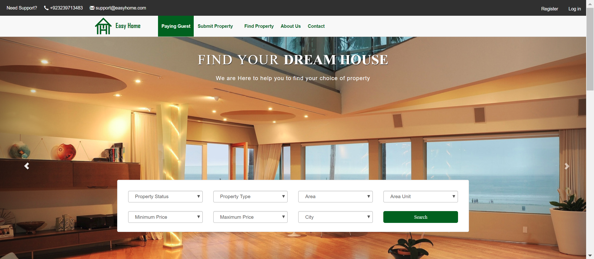
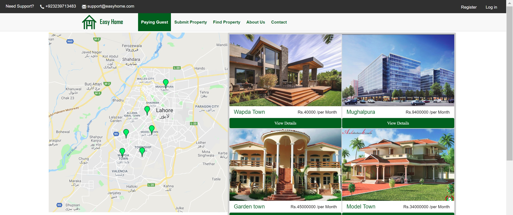
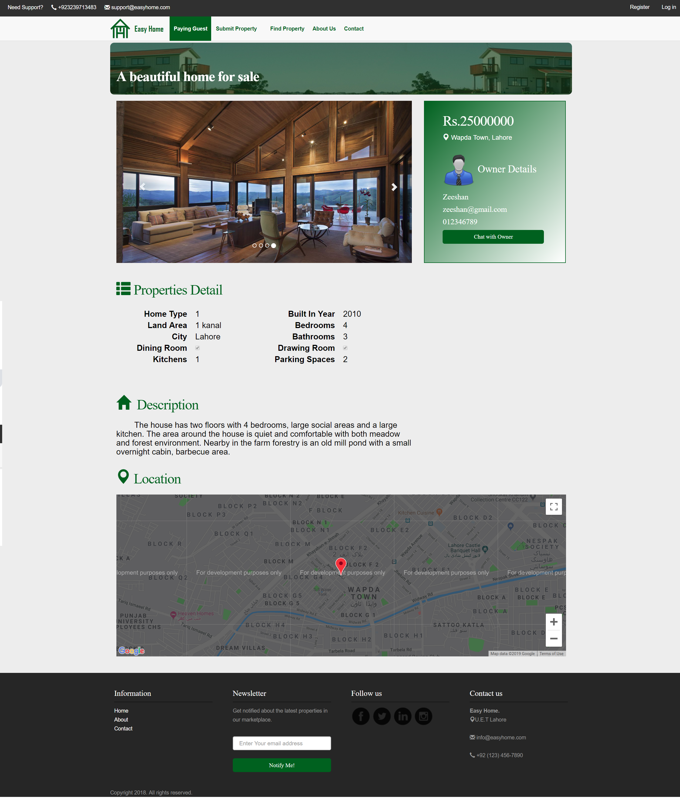
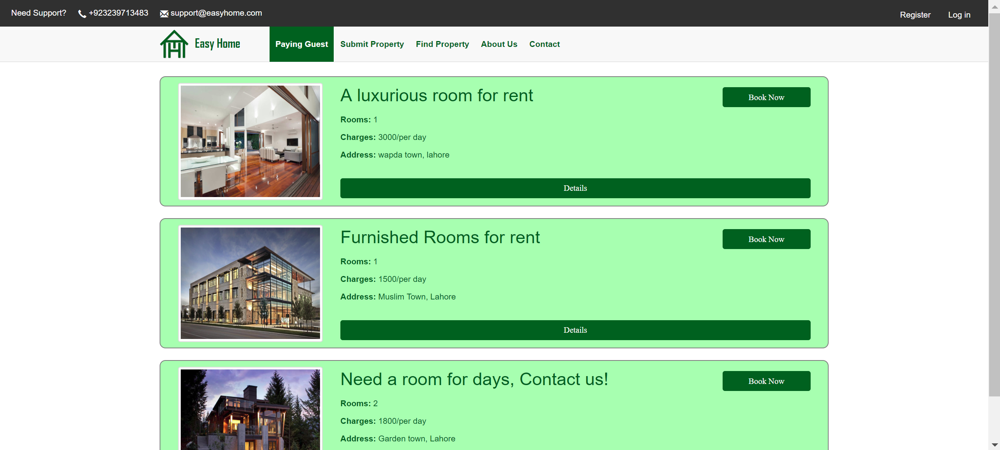

# EasyHome
Real estate website developed on ASP.NET MVC5.

## Features:

#### 1. Sell or Rent Property
Users who want to sell or rent their property can post ads on the website by completing a simple form which contains the details and pictures of the property. Users need to login first if they want to post an ad of the property.

#### 2. Search Property
Users who want to buy or rent the property can search by different types of properties i.e. Buy or Rent, Commercial or Residential or Plot etc. The user can view the list of all related properties on the right side and their locations on the map in the left side.

#### 3. View Property Details
Users can see the details of the property. They can also get the contact details of the seller.

#### 4. Paying Guest
Users can also post ads if they want to sublet free rooms in their house to the paying guest. Hotels can also use this feature. And those who are looking for hotel rooms can search for rooms in their desired location.

